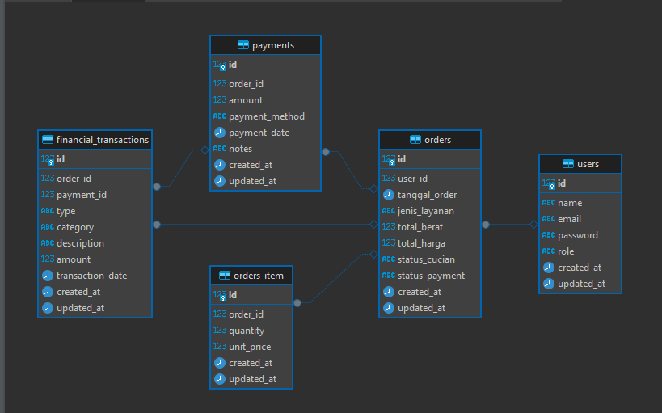

   ## BRIEF SISTEM MANAJEMEN LAUNDRY BERBASIS WEBSITE ##
------------------------------------------------------------

A. Ringkasan Proyek

    Proyek ini bertujuan untuk membangun sistem manajemen laundry berbasis website dengan pendekatan MVP (Minimum Viable Product). Sistem difokuskan pada digitalisasi pencatatan pelanggan, pesanan, dan pembayaran, laporan berkali, serta memberikan akses bagi pelanggan untuk memantau status laundry mereka secara real-time.

B. Tujuan Utama
    - Mendigitalisasi pencatatan transaksi laundry yang sebelumnya manual.
    - Memberikan kemudahan bagi admin dalam mengelola data pelanggan, layanan, pembayaran, pembuatan laporan.

C. Role User :
    * Admin
    * Pelanggan

D.	Adapun fitur yang tersedia :
    1. Login Sistem
    2. Manajemen Pelanggan
       * CRUD data pelanggan
       * Lihat riwayat transaksi pelanggan
    3. Manajemen Pesanan
       * Input data pesanan baru (jenis layanan, jumlah/berat, harga)
       * Update status cucian : dalam proses -> selesai -> diambil
       * Catat  pembayaran (tunai/transfer) -> status: lunas/belum lunas/sisa
    4. Manajemen Pengeluaran dan Kebutuhan Operasional
       * Stok barang: plastik, detergen, parfum, sabun.
       * Upah karyawan: dicatat per pekerjaan/hari sesuai jumlah cucian yang dikerjakan (tidak tetap)
    5. Laporan & Dashboard
       * Laporan harian -> jumlah pesanan, pendapatan, pengeluaran (operasional dan upah karyawan)
       * Laporan mingguan, bulanan, tahunan: pendapatan, pengeluaran (operasional + upah karyawan), serta keuntungan
         bersih
    6. Portal Pelanggan
       * Melihat status pesanan
       * Melihat riwayat transaksi

E.	Techstack
    a.	Frontend    : Next js App Router, Tailwind css, Shadcn ui, Tanstack Query, React hook form, zod
    b.	Backend     : Node.js, Express.js, Sequelize
    c.	Database    : PostgreSQL
    d.  Api testing : Postman

F.	Tabel yang tersedia :
    a.	Tabel users
    b.	Tabel orders
    c.	Tabel orders_item
    d.	Tabel payments
    e.  Tabel Financial_transactions

G. Struktur Database	
   
